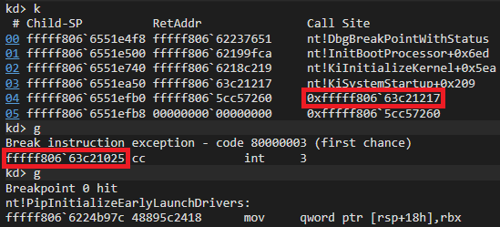

# Parasite

Parasite is a two sector MBR bootkit for x64 Windows. This project is a proof of concept written for educational purposes. Tested on Windows 10 version 21H2. If installed, **there is no guarantee your OS will boot.**

### Features

- Execution of unsigned code as early as *nt!KiSystemStartup*
- Loads a driver before ELAM driver initialization
- Installation is invisible to filesystem filter drivers

### Limitations

- Installer requires Administrator privileges
- Max driver size of ~58KB
- Does not support uninstallation
